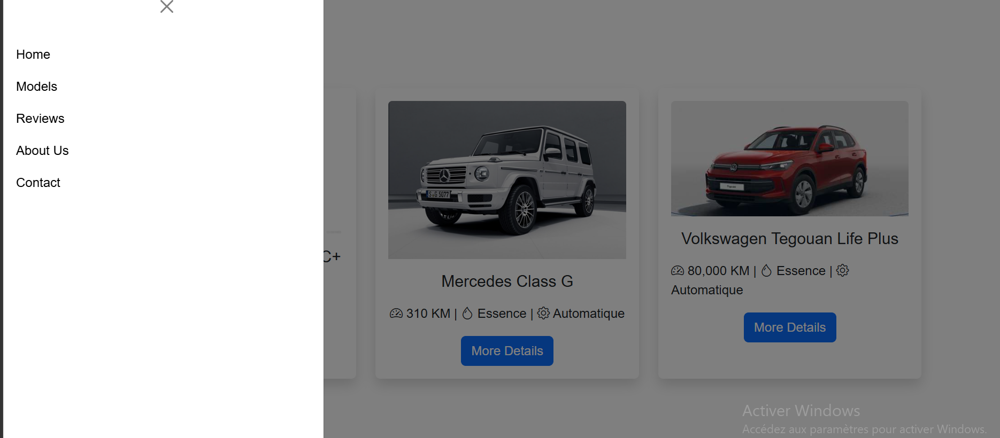

# Car Showroom Website Design 🚗

Design d’un site web moderne pour un showroom automobile, mettant en valeur les véhicules à travers une interface élégante et intuitive.

## 🔧 Technologies

HTML, CSS, JavaScript

## ✨ Fonctionnalités

* Affichage des voitures avec images
* Interface moderne et attractive
* Design responsive (adapté mobile et desktop)
* Navigation simple et fluide

## 📌 Description

Ce projet a été réalisé dans le but de concevoir une interface utilisateur professionnelle pour un showroom de voitures, en mettant l’accent sur le design, l’expérience utilisateur et la présentation visuelle des véhicules.

## 🚧 État du projet

Projet basé sur le design (front-end uniquement), avec possibilité d’ajouter des fonctionnalités dynamiques à l’avenir.

